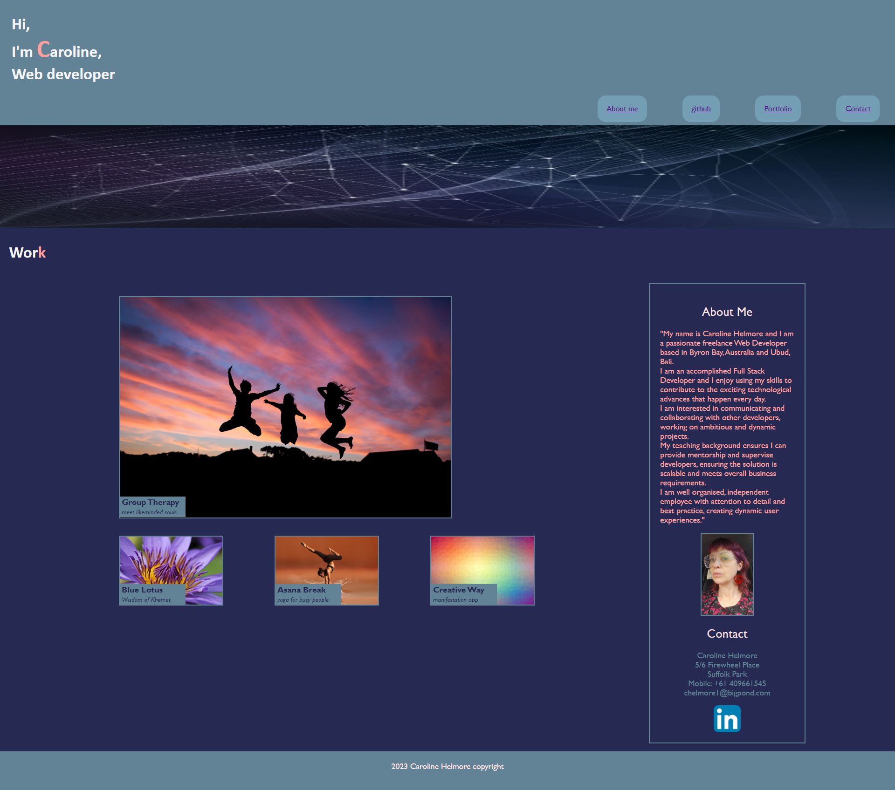

# Caroline-Helmore-landingpage

## Description

To create a landing page for my website to showcase my skills and talents to employers. My portfolio will highlight my strongest work and the thought process behind it. The portfolio is currently using placeholder images and descriptions, in lieu of deployed web applications and will be updated as I create them at a later date.

I learned an immense amount from sketching out a wire-frame, intitial coding with HTML to build the structure and then implementing the CSS to 
modify and style the elements. The webpage has used the advanced CSS skills that I have been recently introduced to such as flexbox, media queries and CSS variables and psuedo-selectors. I enjoyedputting these skills into practice, while using Chrome Dev to inspect the changes I had made and to experiment with different properties before implementing them into my code. 

I tried to keep the design of the page quite simple as I wanted to focus on the technical aspects of the challenge. My next personal challenge would be to redesign the look of the page from the intial wire-frame to create something a bit more visually interesting and edgy.

## Usage

Provide instructions and examples for use. Include screenshots as needed.

To add a screenshot, create an `assets/images` folder in your repository and upload your screenshot to it. Then, using the relative filepath, add it to your README using the following syntax:

https://user-images.githubusercontent.com/122151785/220446953-e28f3c55-bb7b-4da4-b567-7a1a000f5ec7.png

## Credits

Caroline Helmore chelmore1@bigpond.com

## License

No License. 

